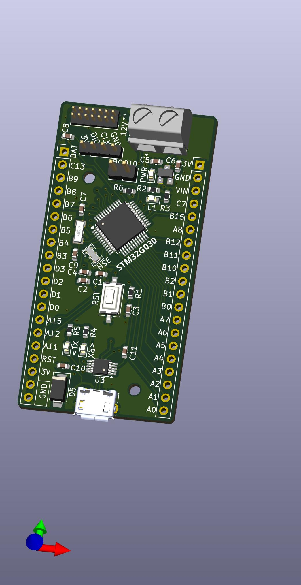
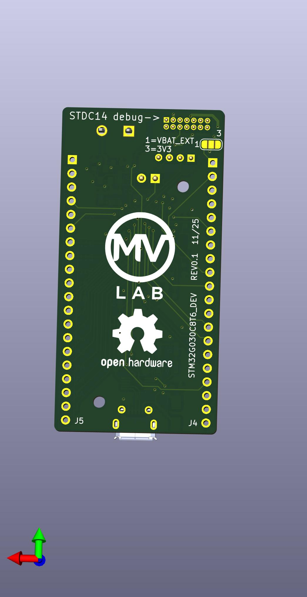

# STM32G030 Development Board

A compact STM32G030C8T6 development board designed for fast prototyping with breadboard-compatible pinout.



## Features

- **MCU:** STM32G030C8T6 (ARM Cortex-M0+, 64KB Flash, 8KB RAM)
- **Voltage Regulator:** AP2210N-3.3V (low dropout, 300mA)
- **USB Interface:** Micro-USB with CH340E USB-to-Serial converter
- **Oscillators:**
  - 8MHz external resonator (HSE)
  - 32.768kHz crystal (LSE for RTC)
- **User LED:** Connected to PC6
- **Status LEDs:** Power, TX, RX
- **Buttons:** Reset, Wake-up
- **Boot Jumper:** For entering bootloader mode
- **Debug:** STDC14 connector compatible with ST-Link
- **Power Input:** USB or external via screw terminal (VIN)
- **GPIO:** 2x20 pin headers (2.54mm pitch) - breadboard friendly

## Pinout

### Side A (J4)
| Pin | Function |
|-----|----------|
| A0-A7 | GPIO Port A |
| B0-B2 | GPIO Port B |
| B10-B12 | GPIO Port B |
| A8 | GPIO Port A |
| B15 | GPIO Port B |
| C7 | GPIO Port C |
| VIN | External Power Input |
| GND | Ground |
| 3V | 3.3V Output |

### Side B (J5)
| Pin | Function |
|-----|----------|
| A11-A12 | GPIO Port A |
| A15 | GPIO Port A |
| D0-D3 | GPIO Port D |
| C1-C4 | GPIO Port C |
| B3-B9 | GPIO Port B |
| C13 | GPIO Port C |
| BAT | Battery Input |
| RST | Reset |
| 3V | 3.3V Output |
| GND | Ground |

## Programming

### Using ST-Link (SWD)
Connect to the STDC14 header or the 4-pin PROG header:
- Pin 1: VCC (3.3V)
- Pin 2: GND
- Pin 3: SWDIO
- Pin 4: SWCLK

### Using USB Bootloader
1. Close the BOOT jumper (JP1)
2. Press Reset or power cycle the board
3. Use STM32CubeProgrammer to flash via USB

### Using CH340E Serial
The onboard CH340E provides USB-to-Serial conversion for:
- Serial debugging/communication
- Programming via UART bootloader

## Power Supply

The board can be powered via:
- **USB:** 5V from Micro-USB connector
- **VIN:** External supply (5-12V) via screw terminal (J1)
- **3V:** Direct 3.3V supply (bypasses regulator)

Protection diode (SS14) prevents reverse polarity damage.

## Bill of Materials

| Component | Value | Package | Quantity |
|-----------|-------|---------|----------|
| U2 | STM32G030C8Tx | LQFP-48 | 1 |
| U1 | AP2210N-3.3TRG1 | SOT-23-5 | 1 |
| U3 | CH340E | MSOP-10 | 1 |
| Y1 | 8MHz Resonator | SMD 3-pin | 1 |
| Y2 | 32.768kHz Crystal | ABS09 | 1 |
| D1 | Power LED | 0603 | 1 |
| D2 | User LED | 0603 | 1 |
| D3 | TX LED | 0603 | 1 |
| D4 | RX LED | 0603 | 1 |
| D5 | SS14 | SMA | 1 |
| J6 | USB Micro-B | Molex 105017 | 1 |

See `STM32G030_DEV/STM32G030_DEV.csv` for complete BOM.

## Board Images

### Top Side


### Bottom Side


## Design Files

- **Schematic & PCB:** KiCad 8 format in `STM32G030_DEV/`
- **Production Files:** Gerbers and assembly files in `STM32G030_DEV/production/`
- **Firmware:** STM32CubeIDE project in root directory

## Demo Firmware

The included STM32CubeIDE project is a test application that demonstrates UART communication by allowing the user to control the LED blink frequency via serial commands.

### Features
- User LED (PC6) blinks at a configurable frequency
- UART interface to change the blink frequency in real-time
- Uses the onboard CH340E USB-to-Serial converter

### Usage
1. Connect the board via USB
2. Open a serial terminal (115200 baud, 8N1)
3. Send commands to change the LED blink frequency

## Getting Started

1. Clone this repository
2. Open `PROGETTOCUBE.ioc` in STM32CubeMX to view/modify pin configuration
3. Open the project in STM32CubeIDE
4. Build and flash to the board

### Basic LED Control
The User LED is configured on PC6. Toggle it with:
```c
HAL_GPIO_TogglePin(USR_LED_GPIO_Port, USR_LED_Pin);
HAL_Delay(500);
```

## License

Open Hardware - See PCB silkscreen for details.

---
**Revision:** 0.1 (11/25)
**Design:** MV Lab
